# 项目简介

索引目录：

[TOC]

## 一、服务端发布 WebService

### 1. 编写 WebService 和 WebMethod

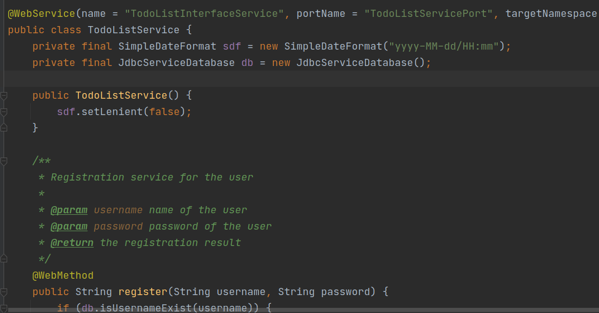


### 2. 通过 EndPoint 发布 WebService

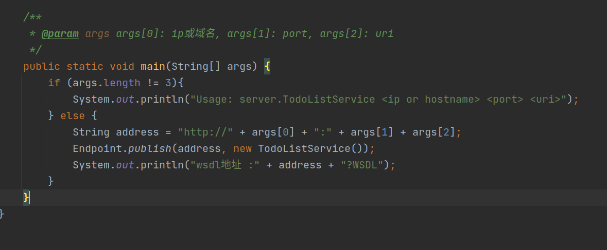


### 3. 输入网址并查看对应的 WSDL

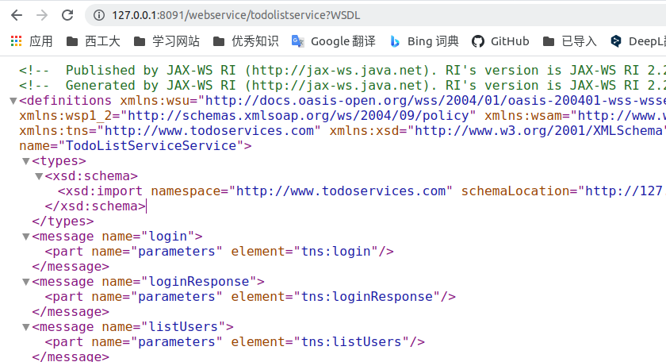


### 4.根据 WSDL 生成代码

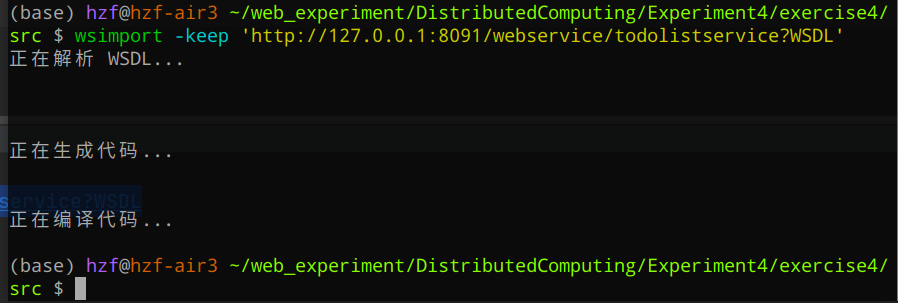

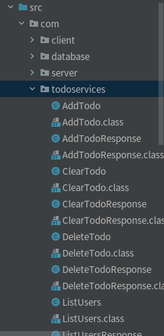


## 二、项目结构说明

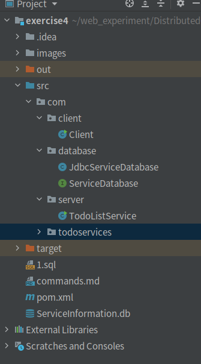

本项目的 WebService 实现类为  `TodoListService`

客户端为 `Client`

采用 `sqlite3` 作为数据库来**持久化存储**用户和待办事项，分别以表 `user` 和 `todo` 存储，具体创建语句写在 `1.sql` 中，两个表的结构如下

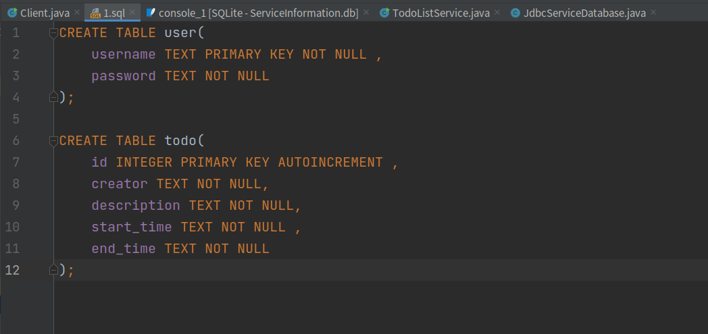

数据库实现类为 `JdbcServiceDatabase` ，其通过 `jdbc` 的方式，连接了用 `sqlite3` 管理的数据库 `ServiceInformation.db` ，并实现了接口类 `ServiceDatabase`

项目采用 `maven` 作为构建工具，具体见 `pom.xml`， 其中 `sqlite-jdbc` 的依赖在这里引入

如果运行不起来，本项目也提供了jar包，名为 [exercise4.jar](exercise4.jar)


## 三、客户端演示

### 1. 注册或登录

#### 1.1 注册三个新用户

```
register user1 user1
quit
register user2 user2
quit
register user3 user3
list
quit
```

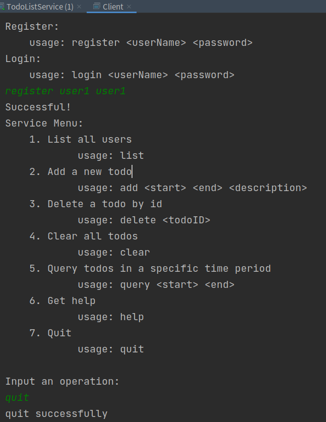


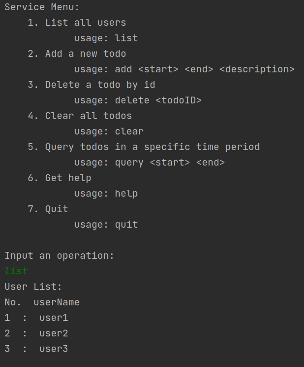


#### 1.2 注册失败——用户名已存在

```
register user1 user4
```

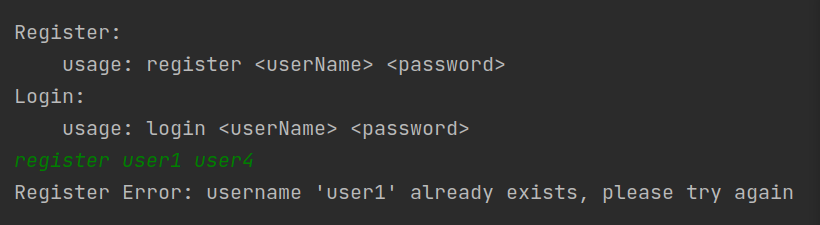


#### 1.3 登录失败——用户名错误或密码错误

```
# password error
login user1 user2
# username error
login user5 user1
```

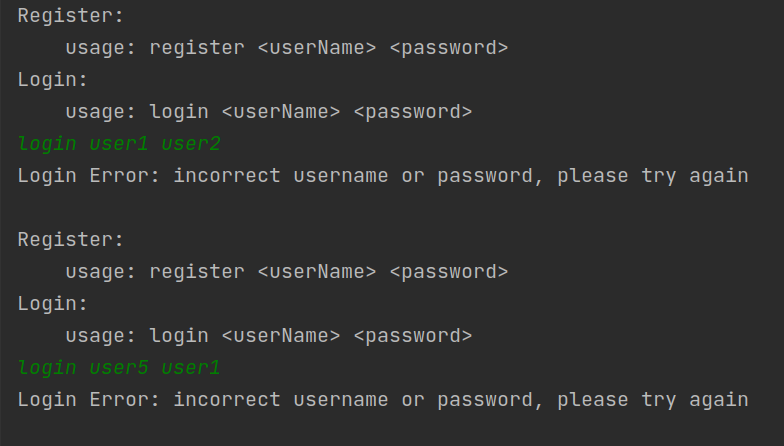


#### 1.4 登录成功

```
login user1 user1
```

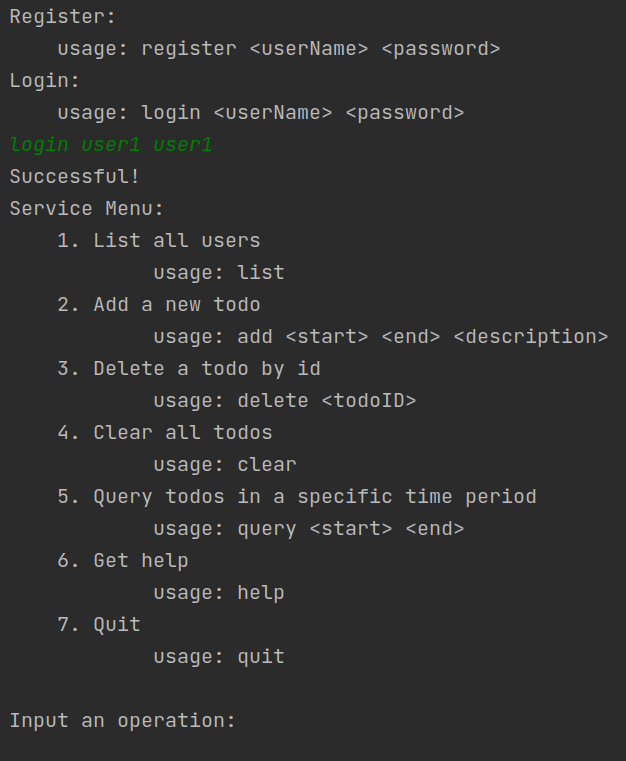


### 2. 简单功能演示

#### 2.1 列出所有用户

```
list
```

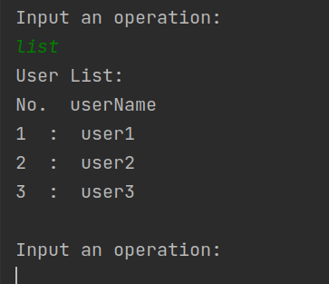


#### 2.2 获取帮助信息

```
help
```

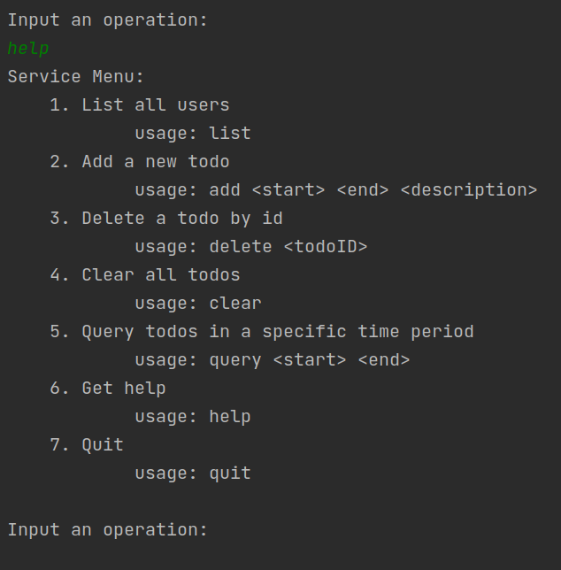


#### 2.3 退出系统

```
quit
```


### 3. 添加代办

#### 3.1 成功添加项目

user1 添加三个待办事项

```
login user1 user1
add 2000-11-11/07:00 2000-11-11/09:00 read a book
add 2000-11-11/09:00 2000-11-11/11:00   write homework
add 2000-11-11/11:00 2000-11-11/12:00     sleep
```

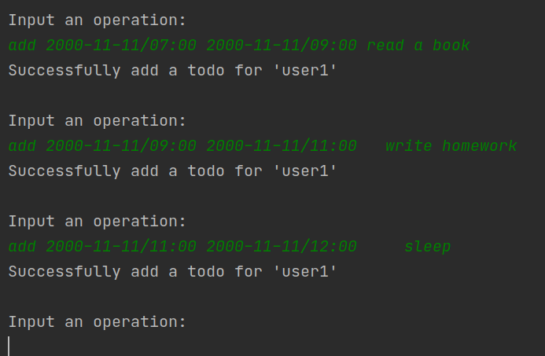

换一个用户 user2，添加两个待办事项（同上，这里不再提供截图）

```
quit
login user2 user2
add 2000-12-12/22:00 2000-12-13/22:30       take a shower
add 2000-12-13/01:00 2000-12-13/09:00 sleep
add 2000-12-12/10:00 2000-12-12/21:00 study!
```

#### 3.2 对错误的时间输入的处理

开始时间比结束时间更晚

```
add 2000-12-13/01:00 2000-12-12/09:00 sleep
```

年份错误

```
add 0000-12-13/01:00 0000-12-13/09:00 sleep
```

月份越界

```
add 2000-15-13/01:00 2000-15-13/09:00 sleep
```

日份越界

```
add 2000-12-33/01:00 2000-12-34/09:00 sleep
```

小时越界

```
add 2000-12-13/26:00 2000-12-13/29:00 sleep
```

分钟越界

```
add 2000-12-13/06:61 2000-12-13/09:62 sleep
```

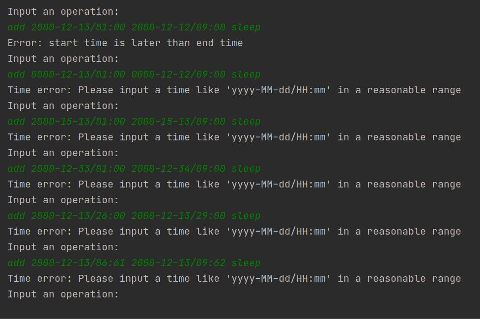


### 4. 查询代办事项

当前的用户为 user2，他有3个代办事项，通过后台数据库可以看到

```sqlite
SELECT * FROM todo;
```

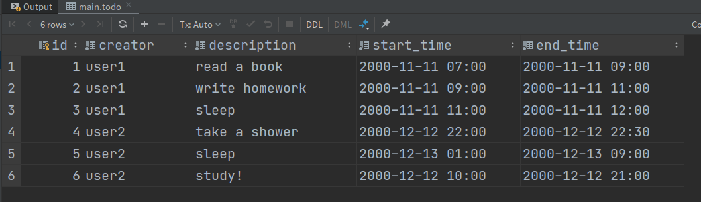

现在我们开始进行代办事项的查询

#### 4.1 查询代办

```
query 2000-12-12/09:00 2000-12-12/23:00
query 2000-12-13/00:00 2000-12-13/23:59
```

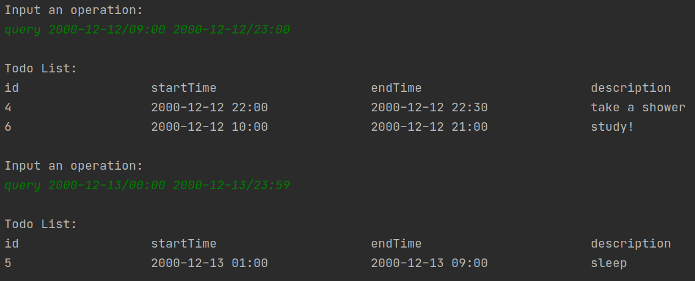


#### 4.2 查询全年的代办

```
query 2000-01-01/00:00 2000-12-31/23:59
```

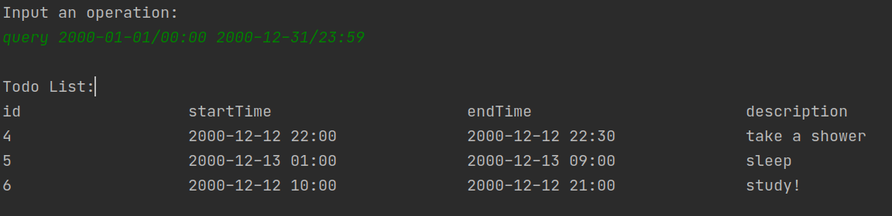

由上图可知，user2 只能查到自己的代办，无法查到 user1 的代办。

#### 4.3 查询为空

```
query 2000-12-12/01:00 2000-12-12/02:00
```

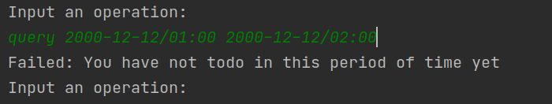

#### 4.4 对错误的时间输入的处理

此处的处理同 **3.2 对错误的时间输入的处理** , 不再重复演示


### 5. 删除代办

#### 5.1 根据id删除代办

```
delete 5
query 2000-01-01/00:00 2000-12-31/23:59
```

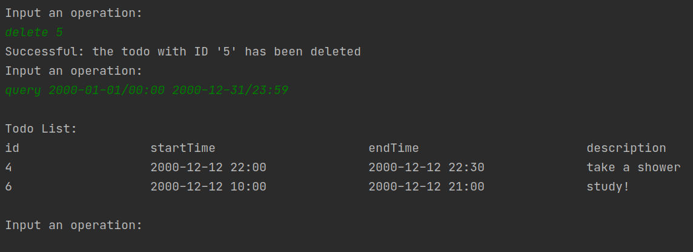

#### 5.2 无效的删除

删除不存在的 id

```
delete 13
```

删除 user1 的代办

```
delete 2
```

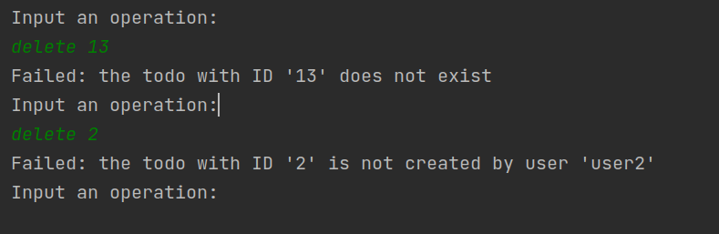


### 6. 清空代办

user2 清空代办

```
clear
query 2000-01-01/00:00 2000-12-31/23:59
```

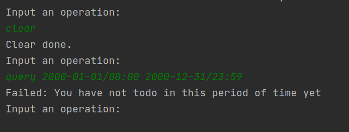

user1 清空代办

```
quit
login user1 user1
clear
query 2000-01-01/00:00 2000-12-31/23:59
```

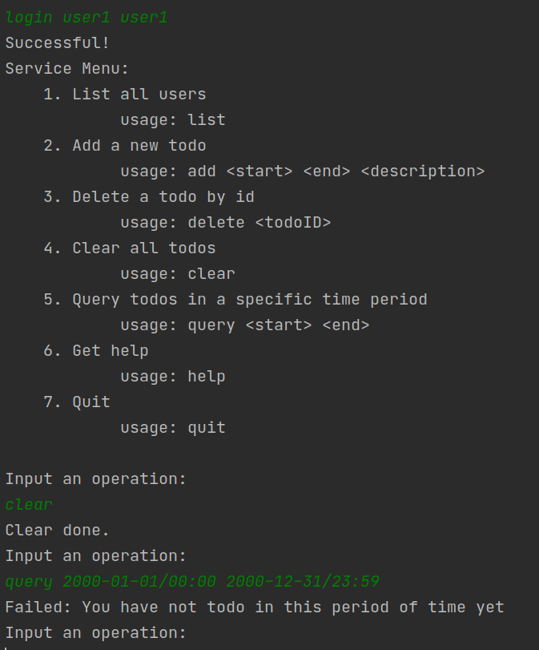


### 7. 清空表的所有数据

```
关闭 server 和 client 的运行

DELETE FROM todo;
DELETE FROM user;
```

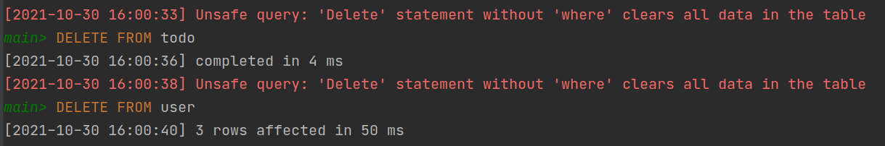